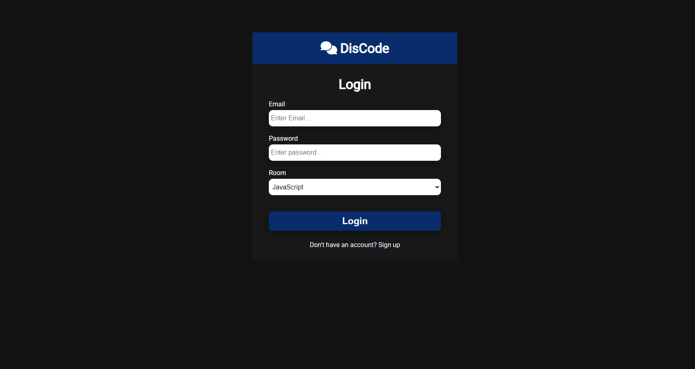

# DisCode Realtime Chat [](https://opensource.org/licenses/MIT)

# Sobre o projeto

O DisCode Realtime chat é uma aplicação de um bate-papo em tempo real construída utilizando NodeJS, Express, Socket.io e Front-end basico

O aplicativo funciona com varias salas de bate papo sobre especifcas linguagens, O usuário pode logar no aplicativo , escolhendo a sala que irá participar e conversar com outros integrantes da sala

# Layout

## Login



## Home page


# Tecnologias utilizadas

## Back end

- NodeJS
- Express
- Express-session
- Socket.io
- MongoDB

## Front end

- HTML / CSS / JS
- EJS

# Como executar o projeto

Pré-requisitos: npm / yarn

```bash

# Retornar ao diretório inicial
cd

# Criar diretório do projeto
mkdir crud

# Ir para o diretório do projeto
cd crud

# clonar repositório
git clone https://github.com/lucaseduardo-meira/DisCode-Realtime-chat

# Entrar na pasta
cd DisCode-Realtime-chat/

# instalar dependências
yarn install / npm install

# executar o projeto
yarn start / npm start

# Projeto estará rodando na port:3000
http://localhost:3000/
```

# Autor

Lucas Eduardo Meira

http://www.linkedin.com/in/lucas-eduardo-meira
